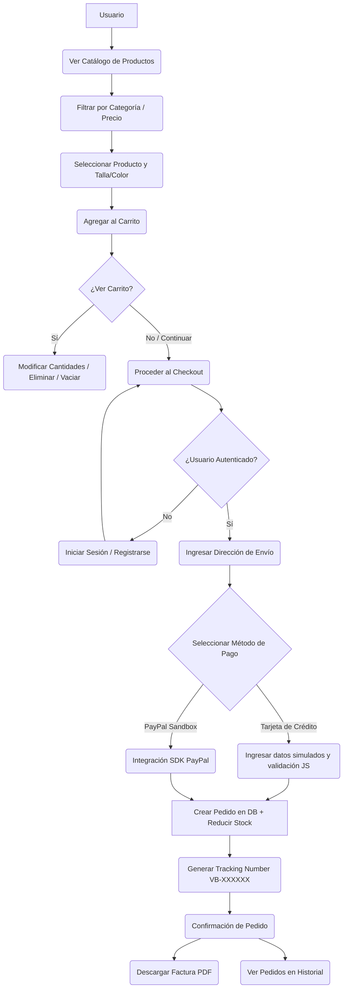

# Vexians Boutique - Tienda Virtual de Moda

¡Bienvenido a **Vexians Boutique**! Esta es una aplicación web de comercio electrónico (E-commerce) moderna y responsiva, diseñada para la venta de ropa y accesorios. El proyecto está construido sobre el framework **Laravel 12** y sigue una arquitectura limpia MVC (Modelo-Vista-Controlador), incorporando componentes reactivos con **Alpine.js** y estilos premium con **Tailwind CSS**.

---

## 🚀 Requisitos del Sistema

Para ejecutar y probar este proyecto de forma local, asegúrate de contar con los siguientes elementos instalados:

*   **PHP:** Versión `8.2` o superior (con las extensiones `pdo_sqlite` y `sqlite3` habilitadas)
*   **Composer:** Gestor de dependencias de PHP
*   **Node.js:** Versión `18` o superior
*   **NPM:** Gestor de paquetes de Node
*   **Base de datos:** SQLite (por defecto)

---

## 🛠️ Instalación y Configuración Paso a Paso

Sigue estos comandos en tu terminal para configurar el entorno local del proyecto:

1.  **Clonar o descargar el proyecto** en tu directorio de trabajo.
2.  **Instalar dependencias de PHP (Composer):**
    ```bash
    composer install
    ```
    *(O bien, si usas el archivo local `composer.phar`: `php composer.phar install`)*
3.  **Copiar el archivo de entorno y configurar variables:**
    ```bash
    copy .env.example .env
    ```
4.  **Generar la clave de la aplicación:**
    ```bash
    php artisan key:generate
    ```
5.  **Crear base de datos SQLite y ejecutar migraciones junto con los datos de prueba (seeders):**
    ```bash
    # Crea el archivo de base de datos SQLite vacío
    copy NUL database\database.sqlite
    
    # Ejecuta migraciones y llena los datos semilla
    php artisan migrate --seed
    ```
6.  **Instalar y compilar los recursos de frontend (Vite & Tailwind):**
    ```bash
    npm install
    npm run build
    ```
7.  **Iniciar el servidor de desarrollo local:**
    ```bash
    php artisan serve
    ```
    El servidor iniciará en: `http://127.0.0.1:8000`

---

## 📂 Estructura Principal del Proyecto

El proyecto está organizado bajo el estándar de directorios de Laravel 12:

```text
TiendaWeb-ProyectoFinal/
├── app/
│   ├── Http/
│   │   ├── Controllers/
│   │   │   ├── CartController.php         # Controla operaciones del carrito
│   │   │   ├── CheckoutController.php     # Procesa compras y pagos simulados
│   │   │   ├── HomeController.php         # Página de inicio con cookies recientes
│   │   │   ├── OrderController.php        # Gestión de pedidos y PDFs
│   │   │   └── ProductController.php      # Catálogo, filtros y detalles de producto
│   ├── Models/
│   │   ├── Categoria.php                  # Modelo de Categoría
│   │   ├── Pedido.php                     # Modelo de Pedido (con Tracking Number)
│   │   ├── PedidoItem.php                 # Modelo de Ítem de Pedido
│   │   ├── Producto.php                   # Modelo de Producto
│   │   └── User.php                       # Modelo de Usuario
│   └── Services/
│       ├── FPDF/                          # Librería FPDF 1.86 para PDF
│       ├── CartService.php                # Lógica del carrito de compras
│       └── PdfReport.php                  # Clase de reportes en PDF y formato
├── database/
│   ├── migrations/                        # Definición de tablas relacionales
│   └── seeders/                           # Datos demo de productos y categorías
├── resources/
│   ├── views/                             # Plantillas Blade (HTML responsivo)
│   │   ├── cart/                          # Vista del carrito
│   │   ├── checkout/                      # Vistas del proceso de compra
│   │   ├── home/                          # Vista de la página principal
│   │   ├── layouts/                       # Estructura del layout común y navbar
│   │   ├── orders/                        # Historial y detalle de pedidos
│   │   └── products/                      # Catálogo y detalle de producto
│   ├── css/                               # Estilos globales (Tailwind CSS)
│   └── js/                                # Scripts (Alpine.js)
├── routes/
│   ├── web.php                            # Definición de todas las rutas web
│   └── auth.php                           # Rutas de autenticación de Breeze
├── tests/                                 # Suite de pruebas automatizadas
│   ├── Feature/                           # Pruebas funcionales e integración
│   └── Unit/                              # Pruebas unitarias de servicios
└── phpunit.xml                            # Configuración de pruebas PHPUnit
```

---

## 🔑 Cuentas de Prueba (Demo)

Para explorar la tienda con roles de cliente y probar el flujo de checkout, puedes iniciar sesión con las siguientes credenciales autogeneradas en los seeders:

| Rol de Usuario | Correo Electrónico | Contraseña |
| :--- | :--- | :--- |
| **Cliente de Prueba** | `demo@vexians.com` | `password` |
| **Administrador** | `admin@vexians.com` | `password` |

---

## 📊 Diagrama del Proceso de Compra (Caso de Uso)

A continuación se muestra el flujo que sigue un usuario al interactuar con la plataforma:



---

## 🧪 Pruebas Automatizadas

El proyecto cuenta con una suite completa de pruebas funcionales y unitarias para asegurar la estabilidad del software:

*   **Pruebas de Autenticación:** Registro de nuevos usuarios y Login/Logout de Breeze.
*   **Pruebas de Catálogo:** Verificación del despliegue de productos activos, filtros de categoría y motor de búsqueda.
*   **Pruebas de Carrito:** Validación de flujos de adición, edición, límites de stock y vaciado del carrito.
*   **Pruebas de Pedidos:** Flujos del checkout, validaciones de seguridad (un usuario no puede ver compras de otros) e historial de pedidos.
*   **Pruebas de Reportes PDF:** Descarga correcta de factura, reporte de ventas mensual y reporte de compras de cliente con cabecera `application/pdf`.
*   **Pruebas Unitarias de Servicio:** Testeo aislado del servicio `CartService` (cálculo de 13% de IVA y envío gratis si supera ₡50,000).

Para ejecutar los tests, corre el siguiente comando en la raíz del proyecto:
```bash
php artisan test
```
*(Si tu PHP de Windows no tiene SQLite habilitado por defecto, ejecuta: `php -d extension=pdo_sqlite -d extension=sqlite3 vendor/phpunit/phpunit/phpunit`)*
